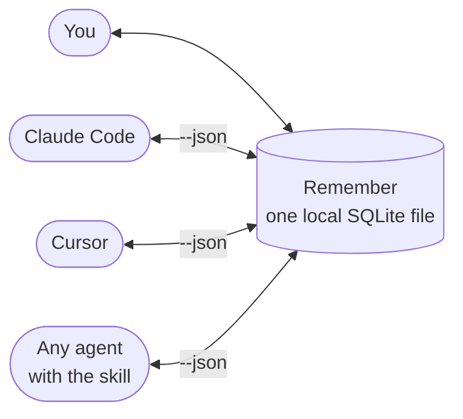

# Getting started with remember

`remember` is a local memory for you and your agents: one SQLite file, full-text search, JSON for scripts.

## Install

```bash
brew install itayavtalyon/remember/remember
remember-install-skill   # links the agent skill into ~/.claude, ~/.cursor, ~/.grok (if present)
```

No Homebrew? Build from source: see [README › Build from source](../README.md#build-from-source)
(`./scripts/install.sh` builds the binary and installs the skill).

## Your first 60 seconds

```bash
remember add --tag idea "Try FTS5 prefix queries"            # save a note, tagged
remember search fts5                                         # full-text search
remember add --key status:demo "Step 1: schema done"         # a keyed card
remember update --key status:demo --text "Step 2: CLI wired" # same card, changed in place
remember tags                                                # every tag, with counts
remember --json get --key status:demo                        # the same data, as JSON
```

## Keys vs tags

- **Tags** group items into buckets (`--tag` is repeatable).
- **A key** makes an item a live card: `add --key` again or `update --key` changes it in place.

## Using it with agents

1. Run `remember-install-skill` (after `brew install`). Agents with the skill call `remember --json …`.
2. Tell your agent which keys to load, e.g. *"At session start, read `workflow:code-review` and `status:myapp`."*

Handoff between sessions:

```bash
# end of session: the agent writes where it stopped
remember add --source agent --key status:myapp --tag status "Paused: tests for login flow next"

# next session: a new agent picks it up
remember --json get --key status:myapp
```



## More

- [README](../README.md): install options, what's new, bins and sync.
- `remember help` and `remember help <command>`: every flag.
